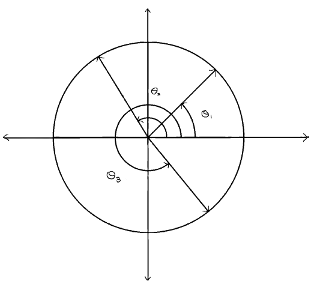

# Quant Interview Question: Arc Length

## Asked by Citadel

### Problem Statement:

#### Three points are chosen independently and uniformly at random on the circumference of a unit circle centered at the origin. Find the expected length of the circular arc that contains the fixed point (1,0).

### Method 1: Unif(0, 2π)

To choose points on the circle, we will use angle from positive x-axis. For example (0,1) will be $\frac{π}{2}$.

$\text{Let } θ_1, θ_2, θ_3 \overset{\text{i.i.d.}}{\sim} Unif(0, 2π), \text{ then length of arc conataining (0,1) will be } 2π - max(θ_1, θ_2, θ_3) + min(θ_1, θ_2, θ_3)$

$E(\text{arc length}) = 2π - E(Y) + E(X) \text{ where, }X \sim min(θ_1, θ_2, θ_3) \text{ and } Y \sim max(θ_1, θ_2, θ_3)$

#### Find Expectation of X:

$$
\begin{aligned}
P(X \le x) &= 1- P(X > x) \\
&= 1 - P(min(θ_1, θ_2, θ_3) > x) \\
&= 1 - P(θ_1 > x, θ_2 > x, θ_3 > x) \\
&= 1 - \frac{(2π - x)^3}{(2π)^3}
\end{aligned}
$$

${\Large f_{X}(x) = \frac{3(2π-x)^2}{(2π)^3}}$

$$
\begin{aligned}
E(X) &= \int_{0}^{2\pi} \frac{3x(2\pi-x)^2}{(2\pi)^3} \, dx \\
&= \frac{3}{8{\pi}^{3}} \int_{0}^{2\pi} (x^3 - 4\pi x^2 + 4\pi^{2}x) \, dx \\
&= \frac{3}{8 \pi^3} (4\pi^4 - \frac{32\pi^4}{3} + 8\pi^4) \\
&= \frac{3\pi}{2} - 4\pi + 3\pi \\
&= \frac{\pi}{2}
\end{aligned}
$$

#### Find Expectation of Y:

$$
\begin{aligned}
P(Y \le y) &= P(max(θ_1, θ_2, θ_3) \le y) \\
&= P(θ_1 \le y, θ_2 \le y, θ_3 \le y) \\
&= \frac{y^3}{(2π)^3}
\end{aligned}
$$

${\Large f_{Y}(y) = \frac{3y^2}{8π^3}}$

$$
\begin{aligned}
E(Y) &= \int_{0}^{2\pi} \frac{3x^3}{8\pi^3} \, dx \\
&= \frac{3}{8{\pi}^{3}} \int_{0}^{2\pi} x^3 \, dx \\
&= \frac{3}{8 \pi^3} \times 4\pi^4 \\
&= \frac{3\pi}{2}
\end{aligned}
$$

$$
\begin{aligned}
E(\text{arc length}) &= 2π - E(Y) + E(X) \\
&= 2\pi - \frac{3\pi}{2} + \frac{\pi}{2} \\
&= \pi
\end{aligned}
$$
$$
\therefore E(\text{arc length}) = \pi \quad \blacksquare
$$