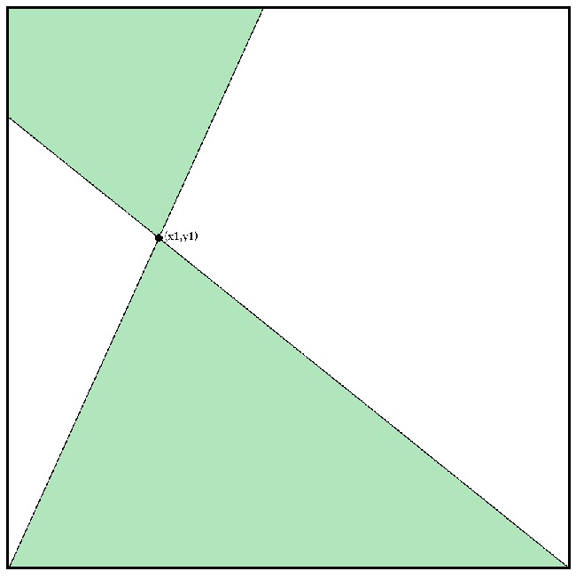

# Quant Interview Question: Square Line Intersection

## Asked by Citadel

### Problem Statement:

#### Let a unit square S=[0,1]×[0,1] be given. Two points $𝑃_1=(𝑋_1,𝑌_1)$ and $𝑃_2=(𝑋_2,𝑌_2)$ are chosen independently and uniformly at random from the interior of 𝑆. Consider the infinite straight line 𝐿 passing through $𝑃_1$ and $𝑃_2$. Find the probability that the line 𝐿 intersects the bottom side of the square, i.e. the line segment {(𝑥,0)∣0≤𝑥≤1}.

### Method 1: Symmmetry

$\text{P(L intersecting Bottom) = P(L intersecting Top) =  P(L intersecting Right) =  P(L intersecting Left)}$

and L surely intersects two side,
$\implies \text{P(L intersecting Bottom) + P(L intersecting Top) +  P(L intersecting Right) +  P(L intersecting Left)} = 2$

$\implies \text{P(L intersecting Bottom) = P(L intersecting Top) =  P(L intersecting Right) =  P(L intersecting Left)} = \frac{1}{2}$

$\therefore \text{P(L intersects Bottom)} = \frac{1}{2}$

### Method 2: Mathematical (Informal)

Choose $P_1=(x_1, y_1)$, then $\text{P(L intersects Bottom | }P_1\text{) = Area of shaded region}$

