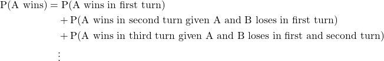

# Quant Interview Question: Two Dice Game

### Problem Statement:

#### Two players take turns rolling two six-sided dice. Player A goes first, followed by player B. If player A rolls a sum of 6, they win. If player B rolls a sum of 7, they win. If neither rolls their desired value, the game continues until someone wins. What is the probability that player A wins?

### Solution:

$\text{P(A wins in his turn)} = \frac{|\{(5,1), (4,2), (3,3), (2,4), (1,5)\}|}{36} = \frac{5}{36}$

$\text{P(B wins in his turn)} = \frac{|\{(6,1), (5,2), (4,3), (3,4), (2,5), (1,6)\}|}{36} = \frac{6}{36} = \frac{1}{6}$

$\text{P(A wins)} = \frac{5}{36} + \frac{31}{36}\times\frac{5}{6}\times\frac{3}{36} + \left(\frac{31}{36}\right)^{2}\times\left(\frac{5}{6}\right)^{2}\times\frac{3}{36} + \dots$

$\text{P(A wins)} = \frac{5}{36}\times\sum_{n=0}^{\infty}\left(\frac{155}{216}\right)^n$

$\text{P(A wins)} = \frac{5}{36}\times\frac{1}{1-\frac{155}{216}} = \frac{5}{36}\times\frac{1}{\frac{216-155}{216}}$

$\text{P(A wins)} = \frac{5}{36}\times\frac{216}{61} = \frac{30}{61} \approx 0.4918$